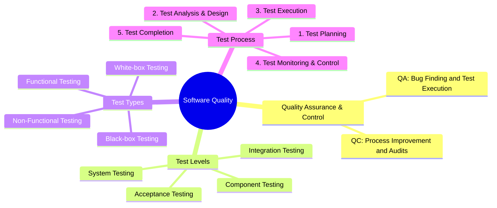

# QA/QC Role & ISTQB Test Process Mindmap (CLO G9.1)

**Student Name:** Phan Trung Tin (ID: 23120372)  
**Exercise:** HW01 - Requirement 1 (CLO G9.1)  
**Standard Referenced:** ISTQB Certified Tester Foundation Level (CTFL) Syllabus v4.0  

---

## 1. Initial AI-Generated Mindmap (Gemini 1.5 Pro)

The following Mermaid diagram represents the raw output generated by the AI tool when requested to build an ISTQB-aligned QA/QC role and process mindmap:



---

## 2. Critical Analysis: 3 Mistakes Identified in AI Output

### Mistake 1: Fundamental Inversion of QA vs. QC Definitions
- **AI Flaw:** The AI assigned *"Bug Finding and Test Execution"* to **QA**, and *"Process Improvement and Audits"* to **QC**.
- **ISTQB CTFL v4.0 Grounding (Section 1.2.2 - Quality Assurance and Testing):**
  - **Quality Assurance (QA)** is process-oriented, preventive, and organizational. It focuses on adherence to proper processes to provide confidence that appropriate quality levels will be achieved. It includes root cause analysis, process improvement, and audits.
  - **Quality Control (QC)** is product-oriented, corrective, and focused on verifying that work products meet specified requirements. Testing is a primary component of QC, designed to find defects and evaluate product quality.
- **Impact:** Inverting these definitions misleads engineers regarding organizational roles, erroneously placing defect execution under QA rather than QC.

### Mistake 2: Complete Omission of Static Testing
- **AI Flaw:** The AI structured "Test Types" exclusively around dynamic concepts and conflated test techniques (Black-box / White-box) with test types, while completely omitting **Static Testing**.
- **ISTQB CTFL v4.0 Grounding (Chapter 3 - Static Testing):**
  - Testing consists of both **Static Testing** (reviews of requirements, user stories, architecture, and static code analysis without executing code) and **Dynamic Testing** (running software with inputs).
  - Omitting static testing ignores the earliest, most cost-effective phase of defect prevention (finding defects before code execution begins).

### Mistake 3: Mispositioning Test Monitoring & Control as a Sequential Step #4
- **AI Flaw:** The AI placed *"Test Monitoring & Control"* as step 4 (after Test Execution and before Test Completion).
- **ISTQB CTFL v4.0 Grounding (Section 1.4.1 & 1.4.2 - Test Process Activities and Tasks):**
  - Test Monitoring and Control is **not** a sequential phase. It is an **ongoing, transversal governance activity** that runs continuously across ALL test activities (from initial Test Planning, Test Analysis, Test Design, Test Implementation, Test Execution, through to Test Completion).
  - Furthermore, the AI combined Test Analysis & Design into a single bullet and omitted **Test Implementation** (creating/ordering test procedures, test data, and automated test scripts).

---

## 3. Corrected ISTQB CTFL v4.0 Process & QA/QC Mindmap

Below is the corrected, comprehensive mindmap reflecting standard ISTQB CTFL v4.0 principles:

```mermaid
mindmap
  root((Software Quality Architecture))
    Quality Assurance (QA - Process Oriented)
      Preventative Quality Culture
      Process Definition & Continuous Improvement
      Quality Audits & Compliance
      Root Cause Analysis (RCA)
    Quality Control (QC - Product Oriented)
      Defect Detection & Verification
      Work Product Inspection
      Software Testing
    Test Activities (ISTQB Process v4.0)
      Transversal Governance (Continuous)
        Test Monitoring and Control
      Test Planning
        Scope, Objectives, Risks & Strategy
      Test Analysis
        Analyzing Test Basis (What to test)
        Identifying Test Conditions
      Test Design
        High-level Test Cases (How to test)
        Test Data Identification
      Test Implementation
        Test Procedures & Test Suites
        Test Automation Scripts & Stubs
      Test Execution
        Running Dynamic & Exploratory Tests
        Logging Actual Results & Defects
      Test Completion
        Exit Criteria Evaluation
        Test Summary Report & Test Asset Archiving
    Testing Disciplines
      Static Testing
        Informal & Formal Reviews (Walkthrough, Inspection)
        Static Analysis (Linters, Security Scanners)
      Dynamic Testing
        Functional Testing (Black-box, White-box)
        Non-Functional Testing (Performance, Security, Reliability)
        Change-Related Testing (Confirmation & Regression)
    Test Levels
      Component (Unit) Testing
      Integration Testing (Component / System)
      System Testing (End-to-End, E2E)
      Acceptance Testing (UAT, Operational)
```
