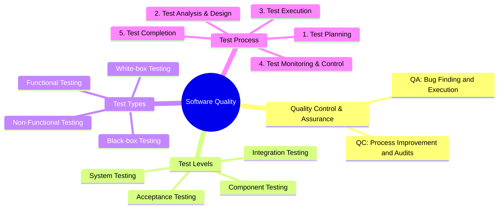

# [AI-02] AI Audit Report Template

**Assignment ID:** HW01-AI  
**Student Name:** Phan Trung Tin  
**Student ID:** 23120372  
**Date:** September 27, 2026  

---

### Artifact 1: QA/QC Role & ISTQB Test Process Mindmap (R1 / CLO G9.1)

#### (1) Prompt + Tool
- **Tool:** Gemini 1.5 Pro (via Google AI Studio)
- **Timestamp:** 10:15 27/09/2026
- **Full Prompt:**
  ```text
  Act as a Senior QA Architect and generate a comprehensive mindmap in Mermaid format representing the QA/QC roles, responsibilities, and the end-to-end software test process according to the latest ISTQB Foundation Level syllabus. Structure it into major branches covering QA vs QC, test levels, test types, and sequential activities in the test process.
  ```

#### (2) AI Output


#### (3) Verdict
**INVALID** (Multiple critical conceptual inversions and sequential process errors violating ISTQB FL v4.0).

#### (4) Reasoning
Citing ISTQB Foundation Level Syllabus v4.0:
- **Section 1.2.2 (Quality Assurance and Testing):** The AI reversed the fundamental definitions of QA and QC. QA is preventative, process-oriented, and focused on providing confidence that quality requirements will be fulfilled; QC is product-oriented, corrective, and involves activities (including testing) aimed at identifying defects.
- **Chapter 3 (Static Testing):** The AI completely omitted static testing (reviews and static analysis) from the test types and test process, presenting testing purely as dynamic execution.
- **Section 1.4.1 & 1.4.2 (Test Process in Context & Activities):** Test Monitoring and Control is an ongoing, continuous activity that occurs throughout the entire testing process from planning to completion, not a sequential step that occurs only after Test Execution.

#### (5) Student Fix
The student corrected the definitions, reorganized QA as process-oriented umbrella and QC as product verification, integrated Static Testing explicitly under test types, and modeled Test Monitoring & Control as a transversal governance activity spanning all test activities.

---

### Artifact 2: Physical Product Test Suite Design (R3 / CLO G9.3)

#### (1) Prompt + Tool
- **Tool:** ChatGPT (GPT-4o)
- **Timestamp:** 11:30 27/09/2026
- **Full Prompt:**
  ```text
  I have a USB-powered adjustable LED desk lamp with 4 inline buttons: Power (ON/OFF), Brightness (-), Light Mode (Yellow, White, Warm White), and Brightness (+). Design a comprehensive 15 test case suite for this physical device following standard QA test case format (ID, Objective, Input, Steps, Expected Result). Include edge cases.
  ```

#### (2) AI Output
```text
TC01: Verify Power Button turns lamp ON.
TC02: Verify Power Button turns lamp OFF.
TC03: Verify Brightness (+) increases light intensity step-by-step.
TC04: Verify Brightness (-) decreases light intensity step-by-step.
TC05: Verify Light Mode switches from Yellow to White.
TC06: Verify Light Mode switches from White to Warm White.
TC07: Verify Light Mode switches from Warm White back to Yellow.
TC08: Press Brightness (+) when already at maximum brightness.
TC09: Press Brightness (-) when already at minimum brightness.
TC10: Press Power button multiple times consecutively.
TC11: Hold Power button for 5 seconds.
TC12: Press Brightness (+) and (-) simultaneously.
TC13: Switch modes rapidly.
TC14: Unplug USB and plug back in.
TC15: Leave lamp ON for 2 hours.
```

#### (3) Verdict
**INCOMPLETE** (The generated test cases exhibit strong software/GUI bias, failing to specify physical parameters, analog electrical conditions, thermal factors, or mechanical dynamics).

#### (4) Reasoning
Citing ISTQB Foundation Level Syllabus v4.0 (Section 4.1 & 4.2 - Test Techniques, Boundary Value Analysis & Equivalence Partitioning):
The AI treated the physical product as a digital finite-state machine with purely discrete states. It failed to account for:
- Input voltage/current thresholds (USB 2.0 500mA vs USB 3.0 900mA vs dedicated 2A adapter).
- Analog PWM duty cycle frequencies and optical flicker (crucial for eye safety and video camera interference).
- Mechanical fatigue, cantilever torque, and thermal dissipation on plastic/aluminum joints.

#### (5) Student Fix
The student redesigned all 15 test cases with rigorous physical verification parameters: precise electrical input specifications (5V ± 5%, 0.5A vs 2.1A), thermal measurements (°C on controller IC), PWM flicker detection, debounce timing for rapid actuation (<100ms intervals), mechanical tilt retention under cantilever load, and non-volatile memory persistence checks. Furthermore, 3 missed physical edge cases were formulated and validated through hands-on testing.
